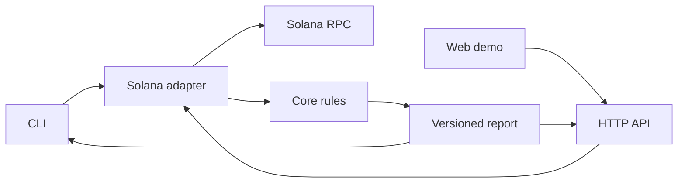

# Token-2022 Preflight — техническое задание

> Рабочее название: `Token-2022 Preflight`  
> Репозиторий: `token2022-preflight`  
> Продукт: CLI-инструмент + TypeScript SDK + HTTP API + демонстрационный web UI  
> Лицензия: MIT

## 1. Описание проекта

Token-2022 Preflight — open-source инструмент для разработчиков, интегрирующих токены Solana в кошелёк, биржу, платёжное приложение, marketplace, escrow или другой dApp.

Инструмент получает адрес токена и, опционально, параметры предполагаемого перевода. Затем он читает фактическое состояние аккаунтов в Solana и объясняет:

- относится ли токен к классическому Token Program или Token-2022;
- какие Token-2022 extensions включены;
- можно ли использовать обычный перевод;
- что однозначно блокирует перевод;
- какие дополнительные инструкции или аккаунты нужны;
- какую комиссию удержит токен;
- какие authority и особенности создают риск для интеграции;
- что инструмент смог проверить, а что осталось неизвестным.

Главная форма продукта — CLI. Веб-интерфейс использует то же ядро и служит публичным демо, playground и наглядной частью портфолио.

```bash
npx token2022-preflight inspect <MINT_ADDRESS>
```

Расширенная проверка:

```bash
token22 inspect <MINT_ADDRESS> \
  --cluster mainnet-beta \
  --amount 100 \
  --source <SOURCE_TOKEN_ACCOUNT> \
  --destination <DESTINATION_TOKEN_ACCOUNT>
```

Машиночитаемый результат:

```bash
token22 inspect <MINT_ADDRESS> --json
```

## 2. Что такое Solana Token-2022

### 2.1. Базовые понятия

Токен в Solana — обычно не отдельный smart contract для каждой монеты. Большинство токенов обслуживаются общей on-chain программой.

- **Mint account** — описание вида токена: decimals, supply, mint authority, freeze authority и extensions.
- **Token account** — on-chain аккаунт, в котором хранится баланс конкретного токена конкретного владельца.
- **Wallet address** — адрес владельца. Это не то же самое, что token account.
- **RPC** — API узла Solana, через которое читается blockchain state.
- **Program** — исполняемый код в Solana, аналог smart contract.

### 2.2. Token-2022

У Solana есть классический Token Program и более новый Token Extensions Program, который называют **Token-2022**.

Token-2022 сохраняет базовую модель SPL-токенов, но позволяет добавлять extensions — дополнительные правила и данные. Например:

- комиссия при каждом переводе;
- запрет переводов;
- пауза переводов;
- обязательный memo;
- permanent delegate;
- вызов пользовательской программы при переводе через Transfer Hook;
- confidential transfers;
- on-chain metadata;
- особые правила отображения баланса.

Из-за extensions интеграция, рассчитанная только на обычный SPL Token, может собрать неправильную инструкцию, неверно рассчитать полученную сумму, забыть дополнительные accounts или memo и получить ошибку при выполнении.

### 2.3. Почему Solana обязательна

Инструмент должен:

- обращаться к Solana RPC;
- проверять owner mint account;
- читать реальные mint и token accounts;
- декодировать TLV extensions Token-2022;
- учитывать текущую epoch при расчёте transfer fee;
- получать конфигурацию Transfer Hook;
- строить выводы по правилам Token-2022 Program.

Без Solana инструменту нечего анализировать, поэтому продукт теряет смысл.

## 3. Пользователь и проблема

### Пользователь

Разработчик, добавляющий токен в wallet, exchange deposit/withdrawal, payment checkout, treasury, marketplace, escrow или иной transfer flow.

### Job to be done

> Перед интеграцией Token-2022 токена понять, как он ведёт себя при переводе, какие изменения нужны в коде и какие ограничения нельзя определить заранее.

### Как задача решается сейчас

Разработчик вручную просматривает mint, получает список extensions, читает документацию по каждому, проверяет token accounts, пишет пробный код и разбирает ошибки simulation/transaction.

### Ценность

Token-2022 Preflight объединяет эти шаги в одну команду и создаёт проверяемый отчёт с on-chain evidence.

## 4. Позиционирование

Продукт не является scam detector, инвестиционным risk score, token explorer, security audit или гарантией прохождения транзакции.

Существующие сканеры в основном отвечают: «Какие свойства есть у токена?»

Token-2022 Preflight отвечает:

> «Что эти свойства означают для моего transfer flow, что потребуется от интеграции и чего мы пока не можем гарантировать?»

Отличия:

1. CLI-first developer tool.
2. Анализ сценария перевода, а не только mint.
3. Детерминированные правила без LLM в runtime.
4. Evidence для каждого существенного вывода.
5. Human-readable и JSON output.
6. Переиспользуемое TypeScript-ядро.
7. Корректный `UNKNOWN` вместо ложного обещания совместимости.

## 5. Компоненты продукта

### 5.1. CLI — основной интерфейс

CLI должен:

- устанавливаться из npm или запускаться через `npx`;
- работать независимо от нашего backend;
- подключаться напрямую к указанному Solana RPC;
- выводить понятный terminal report;
- поддерживать JSON output для CI и скриптов;
- иметь стабильные exit codes;
- не требовать wallet connection;
- не подписывать и не отправлять транзакции.

### 5.2. TypeScript SDK

Переиспользуемая библиотека содержит публичную функцию анализа. CLI и API используют один SDK, а не копируют логику.

```ts
const report = await analyzeTokenTransfer({
  rpcUrl,
  cluster: "mainnet-beta",
  mint,
  amountUi: "100",
  sourceTokenAccount,
  destinationTokenAccount,
});
```

### 5.3. HTTP API/backend

Backend нужен для web demo и будущих внешних интеграций. В MVP он:

- скрывает RPC provider URL/API key веб-приложения;
- выполняет анализ через общий SDK;
- валидирует input;
- ограничивает частоту запросов;
- временно кеширует одинаковые запросы;
- отдаёт версионированный JSON report;
- предоставляет health endpoint.

CLI не обращается к этому API и остаётся самостоятельным.

### 5.4. Web demo

Web нужен для публичной демонстрации, проверки без установки, визуального объяснения findings, просмотра JSON и копирования эквивалентной CLI-команды.

## 6. Минимальные требования MVP

MVP обязан включать:

1. Устанавливаемый и документированный CLI.
2. Basic-анализ mint.
3. Расширенный анализ transfer scenario.
4. `mainnet-beta` и `devnet`.
5. Определение Legacy Token Program и Token-2022 Program.
6. Декодирование ключевых mint/account extensions.
7. Детерминированный rule engine.
8. Human-readable terminal report.
9. JSON output со стабильной схемой.
10. TypeScript SDK, общий для CLI и backend.
11. Backend API для web.
12. Демонстрационный web UI.
13. Unit и integration tests.
14. Docker-конфигурацию для web + API.
15. CI с lint, typecheck, tests и build.
16. README с установкой CLI, примерами и ограничениями.

MVP не обязан включать:

- собственный on-chain program;
- Anchor или Rust;
- создание токена;
- подключение wallet;
- подпись и отправку транзакций;
- полноценную transaction simulation;
- базу данных и аккаунты пользователей;
- анализ цены, ликвидности и holders;
- универсальную матрицу wallets/DEX/exchanges;
- полноценный confidential transfer flow;
- автоматический анализ произвольной логики Transfer Hook.

## 7. Режимы анализа

### 7.1. Basic mint analysis

Обязательны cluster и mint address. Amount опционален. Basic mode сообщает только то, что достоверно определяется по mint account. Если правило зависит от source/destination account, вывод — `UNKNOWN`.

```bash
token22 inspect <MINT>
token22 inspect <MINT> --amount 250.5
token22 inspect <MINT> --cluster devnet
```

### 7.2. Transfer scenario analysis

Принимает cluster, mint, amount, source token account и destination token account.

```bash
token22 inspect <MINT> \
  --amount 250.5 \
  --source <SOURCE_TOKEN_ACCOUNT> \
  --destination <DESTINATION_TOKEN_ACCOUNT>
```

В MVP принимаются адреса token accounts, а не wallet addresses: account-level extensions принадлежат именно token accounts.

## 8. CLI specification

### Имя

Предпочтительный binary: `token22`. Рабочий npm package: `token2022-preflight`; доступность имени проверяется перед публикацией.

### Команды

```bash
token22 inspect <mint>
token22 --help
token22 --version
```

### Флаги `inspect`

| Флаг | Назначение |
| --- | --- |
| `--cluster <cluster>` | `mainnet-beta` или `devnet`. |
| `--rpc-url <url>` | Пользовательский RPC endpoint. |
| `--amount <decimal>` | Сумма в UI units как строка. |
| `--source <address>` | Source token account. |
| `--destination <address>` | Destination token account. |
| `--json` | Только JSON в stdout. |
| `--no-color` | Отключить ANSI colors. |
| `--verbose` | Дополнительные технические детали. |
| `--timeout <ms>` | Timeout RPC-запросов. |

RPC resolution priority:

1. `--rpc-url`;
2. `SOLANA_RPC_URL`;
3. публичный endpoint выбранного cluster с предупреждением о rate limits.

### stdout/stderr

- Отчёт выводится в stdout.
- С `--json` stdout содержит только JSON.
- Progress и diagnostics идут в stderr.
- Stack trace доступен только в verbose/debug mode.
- Spinner и ANSI не должны ломать JSON.

### Exit codes

| Код | Значение |
| ---: | --- |
| `0` | Анализ выполнен, общий status `READY` или `WARNING`. |
| `2` | `ACTION_REQUIRED`. |
| `3` | `BLOCKED`. |
| `4` | `UNKNOWN` или частично неподдерживаемый сценарий. |
| `1` | Invalid input, RPC failure или внутренняя ошибка. |

Exit codes — публичный контракт и должны быть покрыты тестами.

### Пример terminal output

```text
Token-2022 Preflight

Mint       9x...abc
Cluster    mainnet-beta
Program    Token-2022
Status     ACTION REQUIRED

Transfer
  Send       100.000000
  Fee          0.500000
  Receive     99.500000

Findings
  ACTION  Transfer fee must be included
  ACTION  Destination requires a memo
  ACTION  Transfer Hook needs additional accounts
  WARNING Permanent delegate can move or burn tokens

No blockers were found by supported checks. This is not a transaction guarantee.
```

## 9. Статусы

```ts
type FindingStatus =
  | "BLOCKED"
  | "ACTION_REQUIRED"
  | "WARNING"
  | "READY"
  | "UNKNOWN";
```

| Статус | Смысл |
| --- | --- |
| `BLOCKED` | On-chain state однозначно запрещает обычный перевод. |
| `ACTION_REQUIRED` | Перевод возможен только с дополнительными действиями. |
| `WARNING` | Есть риск или необычное поведение без однозначного запрета. |
| `READY` | Поддержанные проверки не нашли препятствий; не гарантия. |
| `UNKNOWN` | Данных или возможностей анализатора недостаточно. |

Приоритет:

```text
BLOCKED > ACTION_REQUIRED > UNKNOWN > WARNING > READY
```

## 10. Обязательные Token-2022 проверки

### 10.1. Program detection

- Legacy Token Program: информационный результат, Token-2022 extensions отсутствуют.
- Token-2022 Program: продолжить extension analysis.
- Account отсутствует: `BLOCKED`, mint not found.
- Owner — другая программа: `BLOCKED`, unsupported owner.
- Decode failed: `UNKNOWN`.

### 10.2. NonTransferable

- `BLOCKED` для обычного `Transfer`/`TransferChecked`.
- Объяснить, что ограничение enforced on-chain.
- Не предлагать обход.

### 10.3. PausableConfig

- Mint paused -> `BLOCKED`.
- Extension присутствует, paused=false -> `WARNING`.
- Показать authority.

### 10.4. TransferFeeConfig

- Определить активную fee configuration для текущей epoch.
- При наличии amount рассчитать expected fee официальным helper.
- Использовать `bigint`, не `number`, для raw amounts.
- Показать amount sent, fee, amount received, basis points, max fee и authorities.
- Вернуть `ACTION_REQUIRED`.

### 10.5. DefaultAccountState и account state

- Default frozen в Basic mode -> `WARNING`, а не ложный `BLOCKED`.
- В Transfer mode проверить source и destination отдельно.
- Фактически frozen source/destination -> `BLOCKED`.

### 10.6. MemoTransfer

- Это account-level extension.
- Без destination account -> `UNKNOWN`.
- Destination требует memo -> `ACTION_REQUIRED`.
- Рекомендовать Memo instruction непосредственно перед transfer.

### 10.7. TransferHook

- Показать hook program address.
- Вернуть `ACTION_REQUIRED`.
- Попытаться разрешить ExtraAccountMetaList официальным helper.
- Показать найденные additional accounts.
- Ошибка разрешения accounts создаёт отдельный `UNKNOWN`, но не уничтожает отчёт.
- Не интерпретировать произвольную бизнес-логику hook program.
- Не обещать, что hook разрешит transfer.

### 10.8. PermanentDelegate

- `WARNING`, не `BLOCKED`.
- Показать delegate address.
- Объяснить его возможности transfer/burn.

### 10.9. Mint и freeze authorities

- Показать обе authority.
- Активная freeze authority -> `WARNING`.
- Authority не доказывает, что account уже frozen.
- `null` показывать как revoked/none.

### 10.10. CPI Guard и Immutable Owner

- Показать informational finding для переданных accounts.
- Не блокировать обычный owner-signed transfer только из-за CPI Guard без подтверждённого условия.

### 10.11. InterestBearingConfig и ScaledUiAmount

- `WARNING`: raw amount и UI amount имеют дополнительные правила.
- Использовать официальный conversion helper, если conversion реализован.
- Не использовать floating point для raw amounts.

### 10.12. Confidential Transfer

- Обнаружить и вернуть `UNKNOWN/UNSUPPORTED` для confidential flow.
- Не утверждать автоматически, что обычный public transfer невозможен.

### 10.13. Неизвестные extensions

- Не игнорировать молча.
- Создать `UNKNOWN` finding.
- Не выдавать `READY`, если неизвестный extension потенциально влияет на transfer.

## 11. Evidence и finding

```ts
interface Evidence {
  account: string;
  accountKind: "mint" | "source" | "destination" | "hook-meta";
  field: string;
  value: unknown;
}

interface Finding {
  id: string;
  status: FindingStatus;
  category: string;
  title: string;
  summary: string;
  requiredActions: string[];
  evidence: Evidence[];
  docsUrl?: string;
  technicalDetails?: Record<string, unknown>;
}
```

Rule engine не создаёт существенный finding без evidence, кроме сетевых и декодирующих ошибок.

## 12. Публичный отчёт

```ts
interface PreflightReport {
  schemaVersion: "1.0";
  engineVersion: string;
  generatedAt: string;
  cluster: "mainnet-beta" | "devnet";
  input: {
    mint: string;
    amountUi?: string;
    sourceTokenAccount?: string;
    destinationTokenAccount?: string;
  };
  tokenProgram: "legacy" | "token-2022" | "unsupported";
  mint: {
    address: string;
    decimals?: number;
    supplyRaw?: string;
    mintAuthority?: string | null;
    freezeAuthority?: string | null;
    extensions: string[];
  };
  transfer?: {
    amountRaw?: string;
    expectedFeeRaw?: string;
    expectedReceivedRaw?: string;
  };
  overallStatus: FindingStatus;
  findings: Finding[];
  limitations: string[];
}
```

Требования:

- `bigint` сериализуются как decimal strings;
- schema version следует semantic versioning;
- порядок findings детерминирован;
- одинаковый input и on-chain state дают эквивалентный report;
- report не содержит RPC API key.

## 13. Backend API

### Endpoints

```text
GET  /health
POST /v1/preflight
```

```json
{
  "cluster": "mainnet-beta",
  "mint": "9x...abc",
  "amountUi": "100",
  "sourceTokenAccount": "...",
  "destinationTokenAccount": "..."
}
```

HTTP semantics:

- `200` — report создан, даже если product status `BLOCKED`;
- `400` — invalid input;
- `404` — mint not found;
- `429` — rate limit;
- `502/503` — RPC unavailable;
- `500` — unexpected error.

Backend responsibilities:

- Zod validation;
- timeout и ограниченный retry временных RPC errors;
- in-memory LRU cache с коротким TTL;
- rate limiting;
- structured logging и request ID;
- CORS allowlist;
- отсутствие stack trace в production;
- маскирование RPC keys и адресов в логах.

Backend не хранит историю, не использует PostgreSQL, не требует регистрации, не принимает private keys и не является обязательным для CLI.

## 14. Web demo

Одна основная страница:

1. Короткое описание.
2. Basic/Transfer selector.
3. Cluster selector.
4. Mint, amount, source, destination.
5. `Run preflight`.
6. Overall status.
7. Transfer summary.
8. Findings.
9. Evidence.
10. JSON viewer/copy.
11. Эквивалентная CLI-команда.
12. Limitations.

Состояния: empty, invalid, loading, success, partial success, rate limited, RPC unavailable и unexpected error.

UX-принципы:

- diagnostic tool, не перегруженный dashboard;
- главный ответ читается за 20–30 секунд;
- цвет дублируется текстом и иконкой;
- details можно раскрыть;
- limitations всегда видны;
- web и CLI используют одинаковые статусы и формулировки.

## 15. Технологический стек

### Платформа

- актуальный Node.js LTS;
- TypeScript, `strict: true`;
- npm workspaces;
- ESM;
- `tsup` для publishable packages и CLI;
- Zod;
- Vitest;
- ESLint + Prettier;
- GitHub Actions.

### Solana

- `@solana/kit`;
- `@solana-program/token-2022`;
- официальные generated clients/helpers.

Точечный legacy adapter допустим, если нужного helper нет в современном SDK. Смешивание SDK изолируется внутри `packages/solana` и не попадает в public API. Актуальные версии и API проверяются по официальным источникам перед scaffold.

### CLI

- Commander;
- `picocolors` или аналог;
- spinner только для interactive terminal и только в stderr;
- собственный formatter;
- package `bin` entry;
- Node shebang в build output.

### Backend

- Fastify;
- Zod schemas;
- Pino;
- `@fastify/cors`;
- `@fastify/rate-limit`;
- LRU cache;
- OpenAPI generation как желательное дополнение.

### Web

- React;
- Vite;
- TypeScript;
- TanStack Query;
- Tailwind CSS;
- React Router только при появлении реальных routes;
- лёгкий syntax highlighting без тяжёлого editor framework.

### Docker

- multi-stage Dockerfile для API;
- multi-stage Dockerfile для web либо nginx/static container;
- `compose.yaml` для web + API;
- CLI не требует Docker;
- production: static hosting для web и container/serverless hosting для API.

### Почему без базы данных

MVP строит анализ из текущего on-chain state, поэтому хранить пока нечего. Архитектура допускает PostgreSQL позже, но сейчас backend stateless, кроме короткого cache.

## 16. Архитектура



Главный принцип: rule engine один. CLI и API не имеют собственных копий правил.

### `core`

Domain types, normalized types, extension rules, status aggregation, report builder и bigint-safe amount utilities. Не зависит от React, Fastify, Commander и RPC client.

### `solana`

RPC client, program detection, fetch/decode mint и token accounts, normalization, epoch, Transfer Hook account resolution и mapping SDK errors.

### `cli`

Commands, flags, config/env resolution, terminal formatting, JSON и exit codes.

### `api`

HTTP validation, rate limit, cache, logging, общий analyzer и HTTP error mapping.

### `web`

Form, HTTP client, report visualization, copy JSON/CLI command и accessibility.

## 17. Структура monorepo

```text
token2022-preflight/
├── apps/
│   ├── api/
│   │   ├── src/{routes,plugins}/
│   │   ├── Dockerfile
│   │   └── package.json
│   └── web/
│       ├── src/{components,features,api}/
│       ├── Dockerfile
│       └── package.json
├── packages/
│   ├── core/
│   │   ├── src/{rules,report,amount}/
│   │   └── package.json
│   ├── solana/
│   │   ├── src/{client,fetch,decode,normalize}/
│   │   └── package.json
│   └── cli/
│       ├── src/{commands,formatters}/
│       └── package.json
├── tests/{fixtures,live}/
├── .github/workflows/ci.yml
├── compose.yaml
├── .env.example
├── package.json
├── tsconfig.base.json
├── PROJECT_SPEC.md
└── README.md
```

Дерево можно скорректировать под toolchain, но границы `core / solana / cli / api / web` обязательны.

## 18. Поток анализа

1. Validate input.
2. Resolve cluster/RPC.
3. Fetch mint account.
4. Detect account owner/program.
5. Decode mint extensions.
6. При наличии source/destination — fetch и проверить оба accounts.
7. Normalize SDK data в domain types.
8. Получить current epoch для transfer fee.
9. Best-effort получить Transfer Hook accounts.
10. Выполнить независимые rules.
11. Собрать evidence.
12. Агрегировать status.
13. Создать versioned report.
14. Отформатировать для CLI/API/web.

Ошибка необязательной проверки создаёт finding и partial report, а не обязательно завершает анализ.

## 19. Валидация и ошибки

- Обрезать пробелы.
- Валидировать Solana address до RPC.
- Amount принимать как string.
- Не преобразовывать raw/UI amount через JS `number`.
- Проверять decimals.
- Source/destination должны принадлежать указанному mint и ожидаемому Token Program.
- Source и destination требуются парой.
- Ограничивать HTTP body.
- Публичный API не принимает произвольный RPC URL во избежание SSRF; CLI принимает.

```ts
type PreflightErrorCode =
  | "INVALID_ADDRESS"
  | "INVALID_AMOUNT"
  | "ACCOUNT_NOT_FOUND"
  | "UNSUPPORTED_OWNER"
  | "MINT_DECODE_FAILED"
  | "TOKEN_ACCOUNT_DECODE_FAILED"
  | "MINT_MISMATCH"
  | "RPC_RATE_LIMITED"
  | "RPC_TIMEOUT"
  | "RPC_UNAVAILABLE"
  | "HOOK_ACCOUNTS_UNRESOLVED"
  | "UNEXPECTED_ERROR";
```

Domain error содержит code, безопасное message и `cause` для debug. RPC errors отличаются от product findings.

## 20. Безопасность

- Read-only.
- Не принимать seed phrase/private key.
- Не подключать wallet.
- Не подписывать и не отправлять транзакции.
- Не выполнять данные из metadata.
- Не использовать `dangerouslySetInnerHTML` для on-chain strings.
- Маскировать secrets/RPC keys в логах.
- API использует allowlist RPC endpoints.
- Ограничить rate и timeout.
- Generated snippets рендерить как текст.
- Dependency audit выполнять в CI.
- README явно говорит, что это не security audit и не гарантия transfer.

## 21. Тестирование

### Core unit tests

1. Legacy mint.
2. Token-2022 без влияющих extensions.
3. NonTransferable -> `BLOCKED`.
4. Paused -> `BLOCKED`.
5. Pausable active -> `WARNING`.
6. Transfer fee без amount.
7. Transfer fee с amount и max cap.
8. Default frozen без accounts не становится ложным `BLOCKED`.
9. Frozen source/destination -> `BLOCKED`.
10. Destination MemoTransfer -> `ACTION_REQUIRED`.
11. Transfer Hook resolved.
12. Transfer Hook unresolved -> partial + `UNKNOWN`.
13. Permanent Delegate -> `WARNING`.
14. Unknown extension -> `UNKNOWN`.
15. Status priority.
16. Bigint serialization.
17. Decimal parser.
18. Deterministic findings order.

### CLI tests

- `--help`, `--version`, flags и config priority;
- чистый JSON stdout;
- diagnostics в stderr;
- exit codes;
- terminal snapshot;
- timeout/SIGINT.

### API tests

- valid/invalid request;
- rate limit;
- RPC error mapping;
- report schema;
- product `BLOCKED` как HTTP `200`;
- отсутствие secrets в response/log snapshot.

### Web tests

- Basic/Transfer forms;
- invalid/loading/error/partial states;
- report rendering;
- copy JSON и CLI command;
- responsive critical flow.

### Live integration tests

- devnet legacy mint;
- devnet Token-2022 mint;
- mint с поддержанным extension;
- invalid/not-found account;
- best-effort mainnet smoke test.

Live tests запускаются отдельно и не делают unit pipeline зависимым от публичного RPC.

## 22. Docker и локальный запуск

```bash
cp .env.example .env
docker compose up --build
```

После запуска web и API доступны на документированных ports, а `GET /health` успешен.

CLI работает без Docker:

```bash
npm install
npm run build
npm link --workspace packages/cli
token22 --help
```

README должен содержать фактически проверенную команду установки из npm или репозитория.

## 23. CI/CD

```bash
npm ci
npm run lint
npm run typecheck
npm test
npm run build
```

Дополнительно:

- dependency/security audit;
- Docker build smoke test;
- CLI smoke test;
- npm publish только из manual/tag workflow;
- version CLI и package совпадают.

## 24. Документация

README содержит:

1. Одно предложение о продукте.
2. GIF/скрин CLI.
3. Установку.
4. Quick start.
5. Basic и Transfer examples.
6. JSON/CI example.
7. Supported checks.
8. Architecture.
9. Docker setup web/API.
10. Development setup без Docker.
11. Environment variables.
12. Limitations и disclaimer.
13. Contribution guide.
14. License.

Не обещать extensions, которых нет в тестах.

## 25. Definition of Done

- CLI устанавливается по инструкции; `token22 --help` работает.
- `token22 inspect <mint>` возвращает terminal report.
- `--json` возвращает чистый JSON.
- Exit codes соответствуют specification.
- Basic и Transfer modes реализованы.
- Legacy/Token-2022 detection работает.
- Обязательные rules реализованы или честно возвращают `UNKNOWN`.
- Report содержит evidence.
- CLI работает напрямую с RPC без backend.
- API использует то же ядро.
- Web использует API и показывает эквивалентный report.
- `docker compose up --build` поднимает web/API.
- Unit и integration tests существуют и проходят согласно документации.
- CI выполняет lint, typecheck, tests и build.
- Секретов в репозитории нет.
- README проверен по реальным командам.
- Публичный demo доступен.
- MIT license добавлена.

## 26. Инструкции Codex

1. Прочитать `PROJECT_SPEC.md` полностью.
2. Проверить актуальные версии и API официальных Solana packages.
3. Сначала создать architecture plan и dependency graph.
4. Реализовывать снизу вверх: types -> fixtures -> rules -> Solana adapter -> CLI -> API -> web.
5. Каждый rule сначала покрывать fixture/unit test.
6. Не помещать RPC logic в React или CLI handler.
7. Не дублировать rules между интерфейсами.
8. Не использовать `number` для raw amounts.
9. Не выдумывать SDK helpers.
10. При недостатке данных возвращать `UNKNOWN`.
11. Не добавлять wallet signing/transaction sending.
12. Не добавлять PostgreSQL, Redis и queue без необходимости MVP.
13. Docker не должен быть обязательным для CLI.
14. JSON schema и exit codes считать public API.
15. После каждого слоя запускать tests/typecheck.
16. Не расширять scope до Definition of Done.
17. Перед завершением выполнить CI-команды локально.
18. В финале перечислить реализованное, ограничения, test/build results, команды, ключевые файлы и unsupported extensions.

## 27. Запрещённые утверждения

Не использовать без доказательства:

- `100% compatible`;
- `transfer guaranteed`;
- `safe token`;
- `no risk`;
- `works in every wallet/DEX`;
- `audited`;
- `simulation passed`, если simulation не выполнялась.

Допустимо:

- `No blockers found by supported checks`;
- `Additional instruction required`;
- `Unsupported by this version`;
- `Unable to determine from provided accounts`;
- `Review and test before production use`.

## 28. Источники технической истины

Приоритет:

1. Код Token-2022 Program.
2. Официальная документация Solana.
3. Официальные Token-2022 JS clients.
4. Документация конкретного wallet/service для утверждений о нём.
5. Сторонние материалы только как объяснение.

Ссылки:

- <https://solana.com/docs/tokens/extensions>
- <https://github.com/solana-program/token-2022>
- <https://solana.com/docs/tokens/extensions/transfer-hook>
- <https://solana.com/docs/tokens/extensions/non-transferrable-tokens>
- <https://solana.com/docs/tokens/extensions/default-state>
- <https://solana.com/docs/tokens/extensions/permanent-delegate>
- <https://solana.com/docs/defi/exchange>
- <https://docs.phantom.com/developer-powertools/solana-token-extensions-token22>

## 29. Главный критерий качества

После запуска CLI разработчик должен получить ответы:

1. Что в токене влияет на transfer flow?
2. Что нужно изменить или добавить в интеграции?
3. Что инструмент пока не способен определить или гарантировать?

Количество показанных полей само по себе не является ценностью. Ценность — корректный, объяснимый и пригодный для автоматизации вывод.
