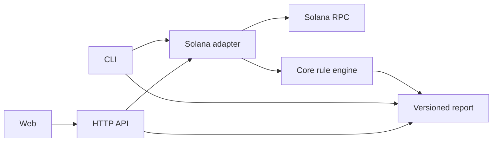

# Token-2022 Preflight

Token-2022 Preflight is a deterministic, read-only compatibility checker for developers and AI coding agents integrating Solana tokens.

Token-2022 extensions can change transfer eligibility, required instructions, account lists, fees, and displayed amounts. Preflight reads the current on-chain account state and turns those details into actionable findings before an integration builds a transfer.

> [!IMPORTANT]
> Token-2022 Preflight is an integration diagnostic, not a security audit or a transfer guarantee. It never signs or sends transactions.


## Quick start

Requirements: Node.js 24 or newer and npm 11 or newer.

Run the CLI without installing it globally:

```bash
npx token2022-preflight inspect <MINT_ADDRESS>
```

The default cluster is `mainnet-beta`. Use `--cluster devnet` when inspecting a devnet mint.

### Global installation

```bash
npm install --global token2022-preflight
token22 inspect <MINT_ADDRESS>
```

## For developers, AI agents, and CI

People can use the regular terminal report, while AI coding agents and CI can use `--json` for stable statuses, required actions, evidence, limitations, and exit codes.

```bash
token22 inspect CKfatsPMUf8SkiURsDXs7eK6GWb4Jsd6UDbs7twMCWxo \
  --cluster mainnet-beta \
  --amount 10 \
  --json
```

An AI agent could reproduce the analysis by implementing its own RPC reads, Token-2022 extension decoding, fee calculations, and result rules. Preflight packages that work into one tested command: it evaluates current on-chain state with fixed rules rather than relying on free-form model reasoning.

A separate Solana Skill can explain to an agent when this check is useful; Preflight performs the check itself. The CLI runs independently and does not depend on the web app, API, or Docker. This repository does not currently provide an MCP integration, AI Skill, or GitHub Action.

- `READY` or `WARNING` — continue while accounting for the findings.
- `ACTION_REQUIRED` — implement the required actions first.
- `BLOCKED` — stop the current transfer flow.
- `UNKNOWN` — make no assumptions; request more data or manual review.

## Usage

### Basic inspection

Inspect only the mint account:

```bash
npx token2022-preflight inspect <MINT_ADDRESS> --cluster mainnet-beta
```

### Transfer inspection

Provide both token accounts and an amount to check account state, source balance, transfer fees, memo requirements, and Transfer Hook accounts:

```bash
npx token2022-preflight inspect <MINT_ADDRESS> \
  --cluster mainnet-beta \
  --amount 100 \
  --source <SOURCE_TOKEN_ACCOUNT> \
  --destination <DESTINATION_TOKEN_ACCOUNT>
```

`--amount` accepts UI units and must not contain more decimal places than the mint supports. Source and destination must be token-account addresses, not wallet addresses, and must be provided together.

Use `--verbose` to include finding summaries, evidence, and technical details in the terminal report.

### JSON output

`--json` writes only the versioned report to stdout, making it suitable for CI and scripts:

```bash
npx token2022-preflight inspect <MINT_ADDRESS> --json > report.json
```

### Exit codes

| Code | Status or error               | Meaning                                                               |
| ---: | ----------------------------- | --------------------------------------------------------------------- |
|  `0` | `READY`, `WARNING`            | No known blocking action is required; warnings may still need review. |
|  `1` | Input, RPC, or internal error | The analysis could not complete normally.                             |
|  `2` | `ACTION_REQUIRED`             | The integration must add required processing or instructions.         |
|  `3` | `BLOCKED`                     | The checked transfer flow is blocked by known state or rules.         |
|  `4` | `UNKNOWN`                     | Supported checks cannot determine transfer readiness.                 |

## RPC configuration

The CLI connects directly to Solana RPC; it does not require this repository's API, web app, or Docker services.

RPC resolution order:

1. `--rpc-url <URL>`
2. `SOLANA_RPC_URL`
3. the public endpoint for the selected cluster

```bash
SOLANA_RPC_URL=https://rpc.example.com \
  npx token2022-preflight inspect <MINT_ADDRESS>
```

```bash
npx token2022-preflight inspect <MINT_ADDRESS> \
  --rpc-url https://rpc.example.com
```

Supported clusters are `mainnet-beta` and `devnet`. Public endpoints can be rate limited, so use a provider endpoint for repeated or production use.

## Supported checks

- Legacy Token Program versus Token-2022 ownership
- Mint and token-account decoding and initialization state
- Non-transferable and pausable mints
- Transfer fee schedule selection, maximum fee, and expected received amount
- Default frozen state and actual source/destination account state
- Source raw balance versus the requested amount
- Destination Memo Transfer requirements
- Transfer Hook detection and ExtraAccountMetaList resolution when transfer context is provided
- Permanent delegate and freeze authority warnings
- CPI Guard and Immutable Owner account information
- Interest-bearing and scaled UI amount warnings
- MetadataPointer and TokenMetadata informational findings
- Confidential and unknown extensions reported as unsupported or unknown

Findings include the observed account fields used as evidence. Unsupported behavior prevents a misleading unconditional `READY` result.

## Limitations

- No transaction simulation is performed.
- A `READY` result means no blocker was found by supported checks; it does not guarantee that a transaction will succeed.
- Transfer Hook accounts can be resolved, but arbitrary hook program business logic is not interpreted.
- Confidential transfer flows are detected but not analyzed.
- Interest-bearing and scaled UI amount extensions are identified, but this version does not calculate their display conversion.
- Source balance cannot be checked unless an amount and both token accounts are provided.
- Results reflect RPC state at analysis time and can become stale.

## Architecture



- `packages/cli` parses commands, renders terminal output, and is the only package intended for npm publication.
- `packages/core` contains RPC-independent report types, amount handling, and rules.
- `packages/solana` reads RPC accounts, validates program ownership, decodes Token and Token-2022 data, and resolves Transfer Hook accounts.
- `apps/api` exposes the analyzer through a validated, rate-limited Fastify endpoint.
- `apps/web` provides the form-based React interface and consumes the HTTP API.

The reusable TypeScript core and Solana adapter exist as internal workspaces in this monorepo. They are not advertised as published npm SDK packages.

## Web and API with Docker

Docker Compose builds and runs the API and web interface:

```bash
docker compose up --build
```

The web interface is available at <http://localhost:8080>, the API at <http://localhost:3000>, and API health at `GET /health`. Analysis uses `POST /v1/preflight`.

Compose has local defaults. To customize them, copy the tracked example and edit the untracked `.env` file:

```bash
cp .env.example .env
docker compose up --build
```

| Variable          | Purpose                                         |
| ----------------- | ----------------------------------------------- |
| `DEVNET_RPC_URL`  | API devnet RPC endpoint                         |
| `MAINNET_RPC_URL` | API mainnet-beta RPC endpoint                   |
| `CORS_ORIGINS`    | Comma-separated web origins accepted by the API |
| `PORT`            | API port, default `3000`                        |
| `SOLANA_RPC_URL`  | Optional direct RPC endpoint for the CLI        |

## Local development

```bash
npm ci
npx playwright install chromium
npm run lint
npm run typecheck
npm test
npm run build
npm run test:e2e
npm audit --audit-level=high
docker compose build
```

Run the locally built CLI:

```bash
node packages/cli/dist/bin.js inspect <MINT_ADDRESS>
```

Live RPC tests are opt-in and remain read-only:

```bash
RUN_LIVE_TESTS=1 \
LIVE_DEVNET_RPC_URL=https://api.devnet.solana.com \
LIVE_DEVNET_LEGACY_MINT=<LEGACY_MINT> \
LIVE_DEVNET_TOKEN_2022_MINT=<TOKEN_2022_MINT> \
npm test -- tests/live
```

## Contributing

Keep changes focused, add behavior tests for fixes and features, and run the full local verification sequence before opening a pull request. Never commit wallet keys, seed phrases, npm tokens, signing logic, or executable handling of untrusted on-chain metadata.

## License

Token-2022 Preflight is available under the [MIT License](LICENSE).
