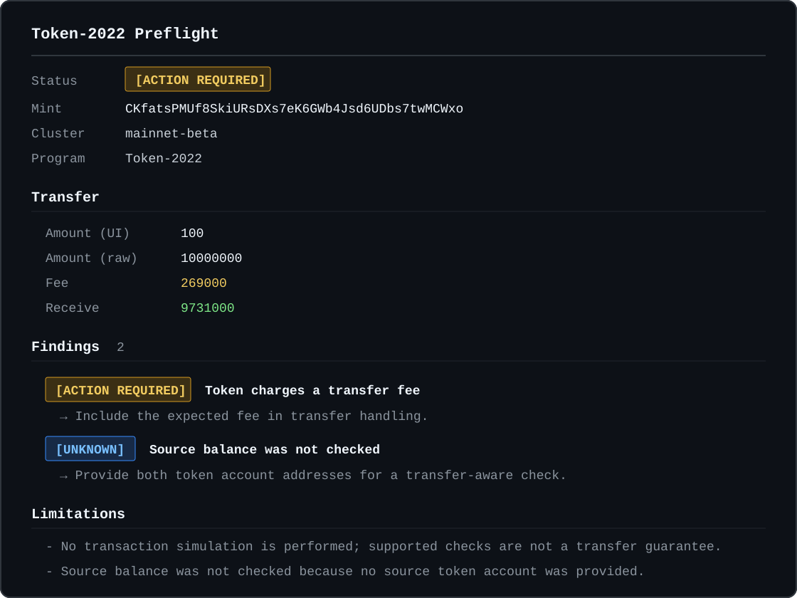

# Token-2022 Preflight

Token-2022 Preflight is a read-only CLI, TypeScript SDK, HTTP API, and web demo that explains how a Solana token affects a transfer flow.

> This is an integration diagnostic, not a security audit or a transfer guarantee. It never signs or sends transactions.



## Quick start

Requirements: Node.js 24 or newer and npm 11 or newer.

```bash
npm ci
npm run build
node packages/cli/dist/bin.js inspect <MINT_ADDRESS> --cluster devnet
```

After publication, the package exposes the shorter command:

```bash
npx token2022-preflight inspect <MINT_ADDRESS>
token22 inspect <MINT_ADDRESS>
```

Transfer scenario:

```bash
token22 inspect <MINT_ADDRESS> \
  --cluster mainnet-beta \
  --amount 100 \
  --source <SOURCE_TOKEN_ACCOUNT> \
  --destination <DESTINATION_TOKEN_ACCOUNT>
```

Machine-readable output for CI:

```bash
token22 inspect <MINT_ADDRESS> --json > report.json
```

`--json` writes only the versioned report to stdout. Exit codes are `0` for `READY`/`WARNING`, `2` for `ACTION_REQUIRED`, `3` for `BLOCKED`, `4` for `UNKNOWN`, and `1` for input, RPC, or internal errors.

## RPC configuration

Resolution priority is `--rpc-url`, `SOLANA_RPC_URL`, then the public endpoint for the selected cluster. Supported clusters are `mainnet-beta` and `devnet`. The CLI connects directly to RPC and does not depend on this project's API.

```bash
SOLANA_RPC_URL=https://your-provider.example token22 inspect <MINT_ADDRESS>
```

## Supported checks

- Legacy Token Program versus Token-2022 owner detection
- Non-transferable and pausable mints
- Transfer fee schedule selection by epoch and bigint-safe fee calculation
- Default and actual frozen account state
- Destination memo requirement
- Transfer Hook detection and explicit unresolved-account findings
- Permanent delegate and freeze authority warnings
- CPI Guard and Immutable Owner account information
- Interest-bearing and scaled UI amount warnings
- Confidential and unknown extensions reported as unsupported/unknown

Every material finding includes the account, field, and observed value used as evidence. Unsupported extensions prevent a misleading `READY` result.

## TypeScript SDK

```ts
import { analyzeTokenTransfer } from "@token2022-preflight/solana";

const report = await analyzeTokenTransfer({
  rpcUrl: process.env.SOLANA_RPC_URL!,
  cluster: "mainnet-beta",
  mint: "<MINT_ADDRESS>",
  amountUi: "100",
  sourceTokenAccount: "<SOURCE_TOKEN_ACCOUNT>",
  destinationTokenAccount: "<DESTINATION_TOKEN_ACCOUNT>",
});
```

Raw token amounts and fees remain `bigint` internally and become decimal strings in the public report.

## Web and API with Docker

```bash
cp .env.example .env
docker compose up --build
```

The tracked `.env.example` contains the same local defaults consumed by `compose.yaml`. Copy it only when you want to customize those values; Docker Compose also runs with its built-in defaults when `.env` is absent.

The web demo is served at <http://localhost:8080>, the API at <http://localhost:3000>, and health is available at `GET /health`. The analysis endpoint is `POST /v1/preflight`.

The API validates requests, limits body size and request rate, caches identical analyses briefly, uses an RPC allowlist configured by environment, and never accepts arbitrary RPC URLs from web clients.

## Development

```bash
npm ci
npm run lint
npm run typecheck
npm test
npm run build
npm audit --audit-level=high
```

Live RPC tests belong under `tests/live` and are intentionally separate from deterministic unit tests. They must remain read-only.

```bash
RUN_LIVE_TESTS=1 \
LIVE_DEVNET_RPC_URL=https://api.devnet.solana.com \
LIVE_DEVNET_LEGACY_MINT=<LEGACY_MINT> \
LIVE_DEVNET_TOKEN_2022_MINT=<TOKEN_2022_MINT> \
npm test -- tests/live
```

### Environment variables

| Variable          | Purpose                                        |
| ----------------- | ---------------------------------------------- |
| `DEVNET_RPC_URL`  | API's allowed devnet RPC endpoint              |
| `MAINNET_RPC_URL` | API's allowed mainnet-beta RPC endpoint        |
| `CORS_ORIGINS`    | Comma-separated web origins allowed by the API |
| `PORT`            | API listen port, default `3000`                |
| `SOLANA_RPC_URL`  | Optional CLI RPC endpoint                      |

## Architecture

```text
CLI ───────────────┐
                   v
Web -> API -> Solana adapter -> RPC
                   |
                   v
             Core rule engine -> versioned report
```

`packages/core` contains RPC-independent rules and report types. `packages/solana` owns Kit RPC and official Token-2022 decoding. The CLI and API call the same analyzer; the web consumes the API report without duplicating rules.

## Limitations

- No transaction simulation is performed.
- Transfer Hook configuration is detected, but arbitrary hook business logic is not interpreted.
- Confidential transfer flows are detected but unsupported.
- Interest-bearing and scaled UI conversions are identified; this version does not calculate their display conversion.
- Public RPC endpoints can be rate limited. Use a provider endpoint for production.
- A `READY` result means no blocker was found by supported checks, not that a transfer is guaranteed.

## Contributing

Keep changes focused, add a failing behavior test before implementation, and run the full verification sequence above. Never add wallet keys, seed phrases, signing, transaction sending, or executable handling of on-chain metadata.

## License

[MIT](LICENSE)
